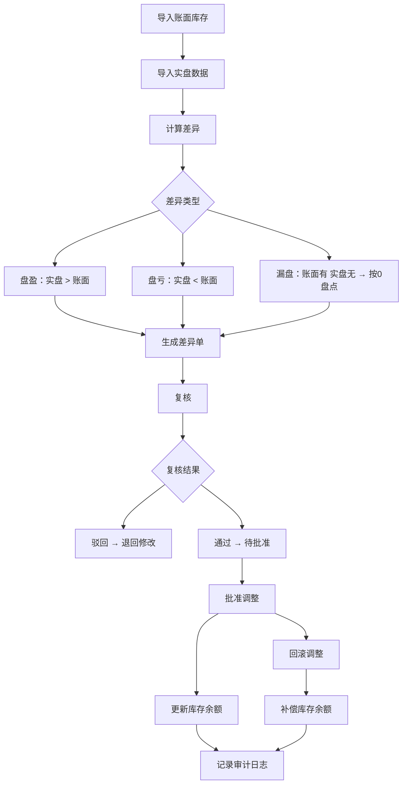

## 1. 产品概述

小仓库盘点差异处理系统——用于对比账面库存与实盘数据，自动计算盘盈/盘亏/漏盘差异，生成差异单，支持复核、批准调整、回滚已批准调整，并导出差异报告和审计记录。面向仓库管理员和审核人员，确保库存数据准确、操作可追溯。

## 2. 核心功能

### 2.1 用户角色

| 角色       | 注册方式   | 核心权限                                   |
| ---------- | ---------- | ------------------------------------------ |
| 仓库管理员 | 系统预设   | 导入数据、查看差异、发起复核、导出报告     |
| 审核人员   | 系统预设   | 复核差异单、批准调整、回滚调整             |

### 2.2 功能模块

1. **数据导入页**：导入账面库存表、实盘表（CSV/Excel），校验数据合法性
2. **差异总览页**：展示盘盈、盘亏、漏盘明细，生成差异单
3. **差异单详情页**：查看单条差异单明细，复核/批准/回滚操作
4. **审计记录页**：查看所有操作日志，导出审计记录
5. **库存导出页**：导出最终库存结果

### 2.3 页面详情

| 页面名称     | 模块名称       | 功能描述                                                                         |
| ------------ | -------------- | -------------------------------------------------------------------------------- |
| 数据导入页   | 账面库存导入   | 上传 CSV 文件，解析并持久化账面库存；记录操作人                                  |
| 数据导入页   | 实盘数据导入   | 上传 CSV 文件，解析并持久化实盘数据；实盘数量为负数时报错，不破坏已有数据        |
| 差异总览页   | 差异计算       | 对比账面与实盘：盘盈（实盘>账面）、盘亏（实盘<账面）、漏盘（账面有但实盘无，按零盘点） |
| 差异总览页   | 差异单列表     | 按批次展示差异单，支持筛选和排序                                                 |
| 差异单详情页 | 差异明细       | 展示单条差异单的所有明细行                                                       |
| 差异单详情页 | 复核操作       | 审核人员标记复核通过/驳回                                                        |
| 差异单详情页 | 批准调整       | 批准后自动更新库存余额                                                           |
| 差异单详情页 | 回滚调整       | 回滚已批准的调整，补偿库存余额，记录回滚原因                                     |
| 审计记录页   | 操作日志       | 按时间线展示所有操作记录（导入、复核、批准、回滚）                               |
| 审计记录页   | 导出审计记录   | 导出 CSV 格式的审计日志                                                          |
| 库存导出页   | 库存导出       | 导出当前最终库存为 CSV                                                           |
| 差异总览页   | 导出差异报告   | 导出差异单为 CSV                                                                 |

## 3. 核心流程

用户上传账面库存和实盘数据 → 系统自动计算差异（盘盈/盘亏/漏盘）→ 生成差异单 → 审核人员复核 → 批准调整（更新库存余额）→ 支持回滚已批准调整（补偿库存）→ 全程记录审计日志

## 4. 用户界面设计

### 4.1 设计风格

- **主色调**：深蓝灰（#1e293b）+ 琥珀色强调（#f59e0b）
- **辅助色**：盘盈绿（#10b981）、盘亏红（#ef4444）、漏盘橙（#f97316）
- **按钮风格**：圆角（rounded-lg），带微妙阴影
- **字体**：标题用 Noto Sans SC Bold，正文用 Noto Sans SC Regular
- **布局风格**：左侧导航栏 + 右侧内容区，卡片式内容组织
- **图标**：Lucide React 图标库

### 4.2 页面设计概览

| 页面名称     | 模块名称     | UI 元素                                                                        |
| ------------ | ------------ | ------------------------------------------------------------------------------ |
| 数据导入页   | 文件上传区   | 拖拽上传卡片，文件类型图标，导入进度条，操作人输入框                           |
| 数据导入页   | 导入历史     | 表格展示已导入批次，状态标签（成功/失败），时间戳                              |
| 差异总览页   | 统计卡片     | 盘盈/盘亏/漏盘数量卡片，带颜色标识和图标                                       |
| 差异总览页   | 差异单列表   | 数据表格，状态标签（待复核/已复核/已批准/已回滚），操作按钮                     |
| 差异单详情页 | 明细表格     | 差异行明细，含货品名称、账面数量、实盘数量、差异数量、差异类型                  |
| 差异单详情页 | 操作区       | 复核/批准/回滚按钮，操作人输入，回滚原因输入                                   |
| 审计记录页   | 时间线       | 垂直时间线布局，操作类型图标，操作人，时间戳，详情                              |
| 库存导出页   | 导出面板     | 当前库存概览表格，导出按钮                                                     |

### 4.3 响应式设计

- 桌面优先设计，最小宽度 1024px
- 表格在小屏幕下支持水平滚动
- 操作按钮在窄屏下堆叠排列

## 5. 验收标准

1. 用样例文件导入账面库存和实盘数据，完成一条盘亏调整的全流程
2. 实盘数量为负数的行报错，且不破坏上一批已导入的数据
3. 账面有但实盘缺失的货品按零盘点生成差异
4. 重启应用后，批准记录、回滚补偿记录、操作人和最终库存导出结果一致
