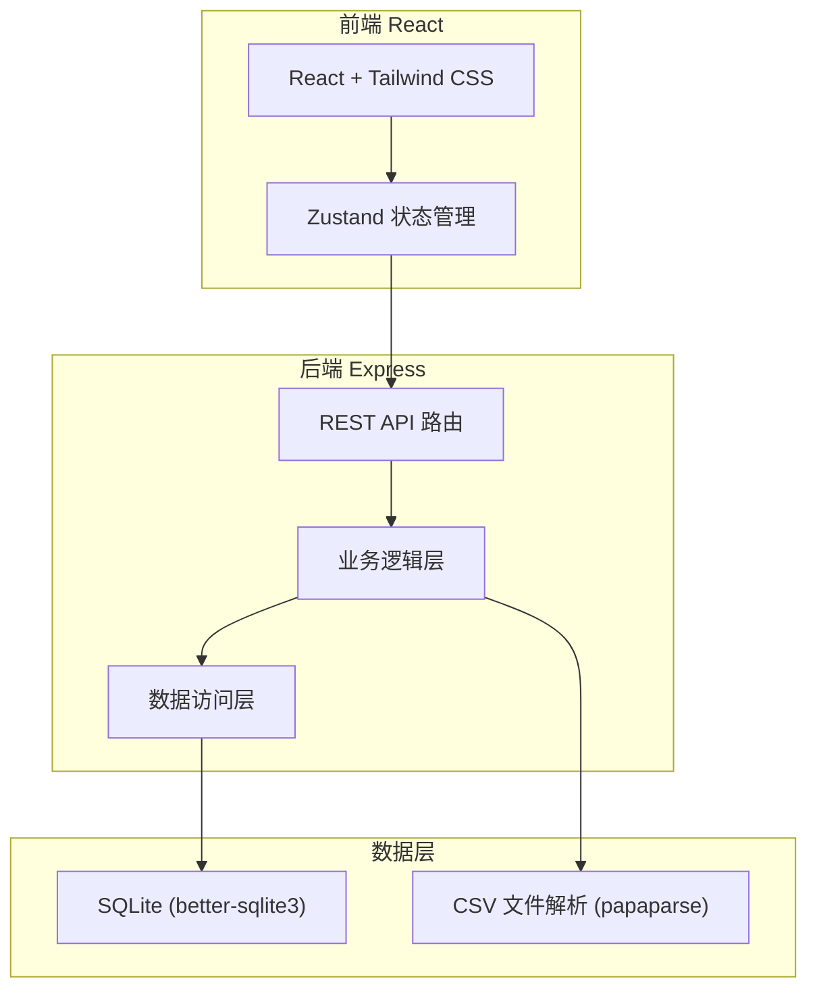
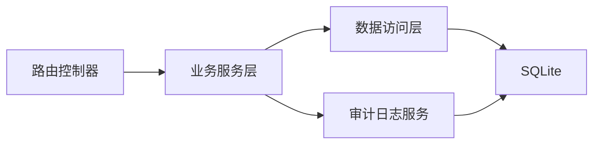
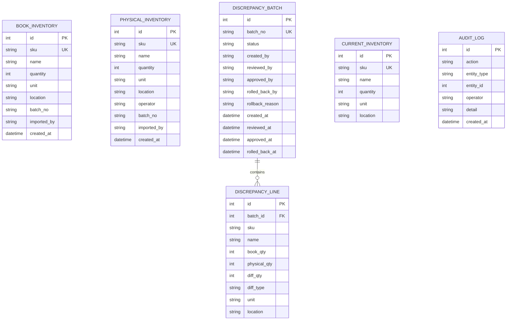

## 1. 架构设计



## 2. 技术说明

- **前端**：React@18 + Tailwind CSS@3 + Zustand + Vite
- **初始化工具**：vite-init（react-express-ts 模板）
- **后端**：Express@4 + TypeScript（ESM 格式）
- **数据库**：SQLite（better-sqlite3，文件持久化）
- **文件解析**：papaparse（CSV 解析）
- **导出**：服务端生成 CSV 响应流

## 3. 路由定义

| 路由                | 用途                     |
| ------------------- | ------------------------ |
| `/`                 | 重定向到数据导入页       |
| `/import`           | 数据导入页               |
| `/discrepancies`    | 差异总览页               |
| `/discrepancy/:id`  | 差异单详情页             |
| `/audit`            | 审计记录页               |
| `/export`           | 库存导出页               |

## 4. API 定义

### 4.1 数据导入

```
POST   /api/inventory/book        上传账面库存 CSV（multipart/form-data）
POST   /api/inventory/physical    上传实盘数据 CSV（multipart/form-data）
GET    /api/inventory/book        获取当前账面库存列表
GET    /api/inventory/physical    获取当前实盘数据列表
```

### 4.2 差异管理

```
POST   /api/discrepancies/calculate   计算差异并生成差异单
GET    /api/discrepancies             获取差异单列表
GET    /api/discrepancies/:id         获取差异单详情（含明细行）
PUT    /api/discrepancies/:id/review  复核差异单
PUT    /api/discrepancies/:id/approve 批准调整
PUT    /api/discrepancies/:id/rollback 回滚已批准的调整
```

### 4.3 审计与导出

```
GET    /api/audit                获取审计记录列表
GET    /api/audit/export         导出审计记录 CSV
GET    /api/inventory/export     导出最终库存 CSV
GET    /api/discrepancies/:id/export  导出差异报告 CSV
```

### 4.4 请求/响应类型

```typescript
interface BookInventoryItem {
  sku: string;
  name: string;
  quantity: number;
  unit: string;
  location: string;
}

interface PhysicalInventoryItem {
  sku: string;
  name: string;
  quantity: number;
  unit: string;
  location: string;
  operator: string;
}

interface DiscrepancyBatch {
  id: number;
  batchNo: string;
  status: "pending_review" | "reviewed" | "approved" | "rolled_back";
  createdBy: string;
  reviewedBy?: string;
  approvedBy?: string;
  rolledBackBy?: string;
  rollbackReason?: string;
  createdAt: string;
  reviewedAt?: string;
  approvedAt?: string;
  rolledBackAt?: string;
}

interface DiscrepancyLine {
  id: number;
  batchId: number;
  sku: string;
  name: string;
  bookQty: number;
  physicalQty: number;
  diffQty: number;
  diffType: "surplus" | "shortage" | "missed";
  unit: string;
  location: string;
}

interface AuditLog {
  id: number;
  action: string;
  entityType: string;
  entityId: number;
  operator: string;
  detail: string;
  createdAt: string;
}

interface ApiResponse<T> {
  success: boolean;
  data?: T;
  error?: string;
}
```

## 5. 服务端架构图



## 6. 数据模型

### 6.1 数据模型定义



### 6.2 数据定义语言

```sql
CREATE TABLE IF NOT EXISTS book_inventory (
  id INTEGER PRIMARY KEY AUTOINCREMENT,
  sku TEXT NOT NULL,
  name TEXT NOT NULL,
  quantity INTEGER NOT NULL CHECK(quantity >= 0),
  unit TEXT NOT NULL DEFAULT '',
  location TEXT NOT NULL DEFAULT '',
  batch_no TEXT NOT NULL,
  imported_by TEXT NOT NULL DEFAULT '',
  created_at TEXT NOT NULL DEFAULT (datetime('now'))
);

CREATE TABLE IF NOT EXISTS physical_inventory (
  id INTEGER PRIMARY KEY AUTOINCREMENT,
  sku TEXT NOT NULL,
  name TEXT NOT NULL,
  quantity INTEGER NOT NULL CHECK(quantity >= 0),
  unit TEXT NOT NULL DEFAULT '',
  location TEXT NOT NULL DEFAULT '',
  operator TEXT NOT NULL DEFAULT '',
  batch_no TEXT NOT NULL,
  imported_by TEXT NOT NULL DEFAULT '',
  created_at TEXT NOT NULL DEFAULT (datetime('now'))
);

CREATE TABLE IF NOT EXISTS discrepancy_batch (
  id INTEGER PRIMARY KEY AUTOINCREMENT,
  batch_no TEXT NOT NULL UNIQUE,
  status TEXT NOT NULL DEFAULT 'pending_review' CHECK(status IN ('pending_review','reviewed','approved','rolled_back')),
  created_by TEXT NOT NULL DEFAULT '',
  reviewed_by TEXT DEFAULT NULL,
  approved_by TEXT DEFAULT NULL,
  rolled_back_by TEXT DEFAULT NULL,
  rollback_reason TEXT DEFAULT NULL,
  created_at TEXT NOT NULL DEFAULT (datetime('now')),
  reviewed_at TEXT DEFAULT NULL,
  approved_at TEXT DEFAULT NULL,
  rolled_back_at TEXT DEFAULT NULL
);

CREATE TABLE IF NOT EXISTS discrepancy_line (
  id INTEGER PRIMARY KEY AUTOINCREMENT,
  batch_id INTEGER NOT NULL REFERENCES discrepancy_batch(id),
  sku TEXT NOT NULL,
  name TEXT NOT NULL,
  book_qty INTEGER NOT NULL DEFAULT 0,
  physical_qty INTEGER NOT NULL DEFAULT 0,
  diff_qty INTEGER NOT NULL DEFAULT 0,
  diff_type TEXT NOT NULL CHECK(diff_type IN ('surplus','shortage','missed')),
  unit TEXT NOT NULL DEFAULT '',
  location TEXT NOT NULL DEFAULT ''
);

CREATE TABLE IF NOT EXISTS current_inventory (
  id INTEGER PRIMARY KEY AUTOINCREMENT,
  sku TEXT NOT NULL UNIQUE,
  name TEXT NOT NULL,
  quantity INTEGER NOT NULL DEFAULT 0,
  unit TEXT NOT NULL DEFAULT '',
  location TEXT NOT NULL DEFAULT ''
);

CREATE TABLE IF NOT EXISTS audit_log (
  id INTEGER PRIMARY KEY AUTOINCREMENT,
  action TEXT NOT NULL,
  entity_type TEXT NOT NULL,
  entity_id INTEGER NOT NULL,
  operator TEXT NOT NULL DEFAULT '',
  detail TEXT NOT NULL DEFAULT '',
  created_at TEXT NOT NULL DEFAULT (datetime('now'))
);

CREATE INDEX IF NOT EXISTS idx_discrepancy_line_batch ON discrepancy_line(batch_id);
CREATE INDEX IF NOT EXISTS idx_audit_log_entity ON audit_log(entity_type, entity_id);
CREATE INDEX IF NOT EXISTS idx_audit_log_created ON audit_log(created_at);
CREATE INDEX IF NOT EXISTS idx_book_inventory_sku ON book_inventory(sku);
CREATE INDEX IF NOT EXISTS idx_physical_inventory_sku ON physical_inventory(sku);
```
